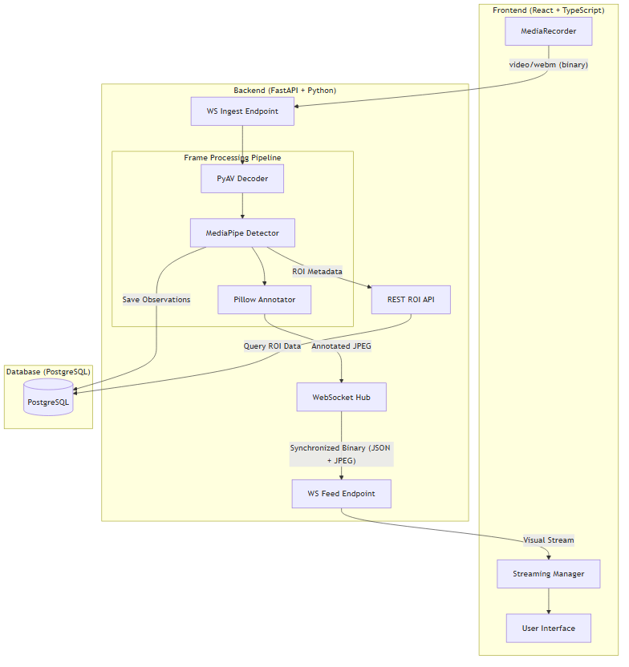

# Real-Time Face Detection Video Streaming System

Containerized FastAPI, PostgreSQL, and React application for receiving a browser video feed,
detecting a face, drawing a minimal axis-aligned ROI without OpenCV, persisting ROI data, and
showing the annotated stream in the frontend.



## Quick Start

1. Start the stack in production mode:

   ```bash
   docker compose up --build
   ```

2. Open the frontend at `http://localhost:5173`.
3. Click `Start stream` and allow camera access.

The backend container runs Alembic migrations automatically before starting the API.

## API Surface

- `WS /ws/video/ingest` receives `video/webm` chunks from the browser camera.
- `WS /ws/video/feed?session_id=<uuid>` serves a synchronized binary stream.
  - Payload: `[4-byte JSON length] [JSON metadata] [JPEG frame]`.
- `GET /api/roi?session_id=<uuid>&limit=100` returns persisted ROI observations from PostgreSQL.
- `GET /health` returns service health.

## Implementation Notes

- **Optimized Protocol:** Uses a custom binary WebSocket protocol to synchronize ROI metadata with video frames, eliminating jitter.
- **Production Ready:** Multi-stage Docker builds with Nginx serving the frontend and proxying backend requests.
- **No OpenCV:** Video decoding uses PyAV, face detection uses MediaPipe, and annotation uses Pillow.
- **Persistence:** ROI observations are stored in PostgreSQL with SQLAlchemy and Alembic.

## Local Development

- Backend: `cd backend && pip install ".[dev]" && alembic upgrade head && uvicorn app.main:app --reload`
- Frontend: `cd frontend && npm install && npm run dev`

